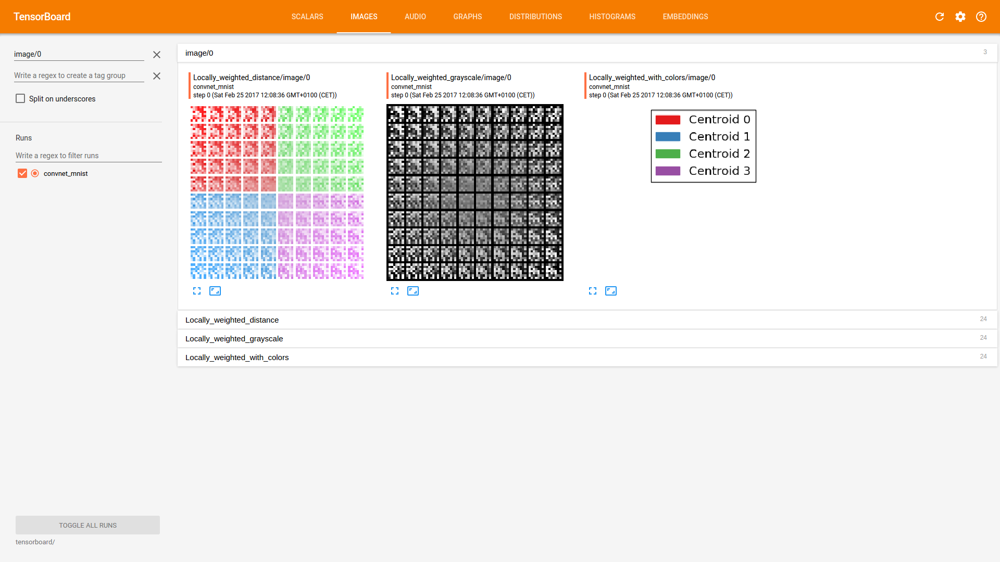
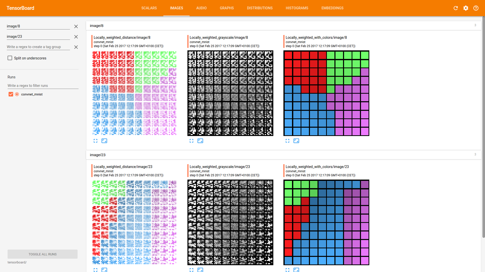

sisws
=====

Demo of *spatial interpolation soft weight sharing layer*. It is a
compromise between the locally connected layers as in
[“DeepFace”](https://research.fb.com/wp-content/uploads/2016/11/deepface-closing-the-gap-to-human-level-performance-in-face-verification.pdf)
and the *hard* weight sharing that is usually found in convolutional
layers.

Explanation
-----------

Instead of the global weight sharing that forces all weights to be
exactly the same irrespective of the spatial location, this layer uses
kernels that are each given a ’centroid’. For brevity, we will refer to
these units as kernel centroid pairs (KCP). What we want is that the
activations of neurons near a KCP’s centroid are close to those that
would have been obtained when using the KCP’s kernel, and less like the
activations that would have been obtained when using the kernels of more
distant KCPs. Additionally, when a spatial location is somewhere in
between two centroids, it should inherit some of the weights of both
kernel centroid pairs.

We can do accomplish this by defining a similarity function that is
defined on the spatial domain of the convolutional output. The column
and row indices will be translated to cartesian coordinates which will
be used to compute local weighting coefficients. For now this similarity
function is some exponential similarity function.

The kind of soft weight sharing is accomplished by using multiple KCPs.
Each KCP first computes its activation, just like a single convolutional
layer would do. Then, we linearly combine the results of these KCPs by
using spatial coefficients which are determined by the spatial cells in
the output tensors with respect to the centroids of each KCP. As a
result, when a spatial cell is close to a certain KCP’s centroid, its
‘local’ kernel will look most like the kernel of that particular KCP.
Note that each locally determined output is still factored by several
convolution kernels. Hence, to a certain extent, one could regard this
as soft weight sharing or distance based weight sharing. This should
result in a gradual change of local kernels when moving from centroid to
centroid, allowing the features to be significantly more complex with
relatively few extra parameters. Put mathematically, we define the
output of a spatial weight sharing layer as follows:

 

where 
 is the output tensor, 
  
  are rank 4 weight tensors, 
   is the rank 4 input tensor,

 is a rank 4 similarity tensor with
 
 where 
parameterizes the centroid of the $s$-th shared convolution. Note that

and 

denote element-wise operations with optional
broadcasting along singleton dimensions. The function 
 
 gives
the ‘similarity’ of a spatial cell located at  
with
respect to some convolution’s centroid . 
It is intresting to
see whether the network can also learn optimal centroids by also varying
.

Content of this repo
--------------------

This repo contains a minimal example demonstration in which the layer is
used for the MNIST digit classification task. This task is perhaps less
suitable than the frontalized faces data that Taigman et al. worked on,
because the local specialization of neurons by means of these KCPs will
be more beneficial if the spatial structure across the images in the
data is roughly consistent, which is not the case for MNIST.
Nevertheless, the visualizations in TensorBoard help to understand
what’s going on!

The spatial weight sharing layer can be found in `sisws.py`.

Running the code
----------------

To run the code with default parameters, simply do: 
```bash
python3 train.py
```

Optionally, you might want to check out the other parameters:
```
usage: train.py [-h] [--color_coding]
                [--centroid_grid CENTROID_GRID [CENTROID_GRID ...]]
                [--n_centroids N_CENTROIDS] [--logdir LOGDIR]
                [--centroids_trainable] [--log_verbosity LOG_VERBOSITY]
                [--n_filters N_FILTERS [N_FILTERS ...]] [--n_epochs N_EPOCHS]

Demonstration of the soft spatial weight sharing layer

optional arguments:
  -h, --help            show this help message and exit
  --color_coding        Whether to use color coding in TensorBoard
                        visualizations
  --centroid_grid CENTROID_GRID [CENTROID_GRID ...]
                        Grid in which the centroids are arranged at
                        initialization
  --n_centroids N_CENTROIDS
                        If n_centroids is given, the centroids are initialized
                        randomly
  --logdir LOGDIR       Specify dir for TensorFlow logs, defaults to [project_folder]/tensorboard
  --centroids_trainable
                        If given, the centroid positions will be trainable
                        parameters
  --log_verbosity LOG_VERBOSITY
                        TensorBoard log verbosity
  --n_filters N_FILTERS [N_FILTERS ...]
                        Number of filters in the conv layers.
  --n_epochs N_EPOCHS   Number of training epochs.
```

So you could do something like:
```bash
python3 train.py --centroids_trainable  --n_filters 24 48 --centroid_grid 3 3
```
This runs the
program in which the centroids are included as trainable parameters, the
first convolutional layer uses 24 output features, the second
convolutional layer uses 48 output features and the centroid grid is
initialized as 3 x 3.


TensorBoard
-----------
To get a good impression of what's going on inside these layers, have a look at TensorBoard. By default, the logging 
folder is \[project_folder\]/tensorboard, so by doing:
```bash
tensorboard --logdir tensorboard
```
Then head over to the image tab to see the visualization of locally weighted kernels. Below in the image on the left you
see the color coding that indicates which centroid is closest. In this case the centroids were initialized in a 
grid-like fashion. 



And here is what you obtain when you also let the centroids be trainable:


Gender recognition results
--------------------------
In the plot below you can see the intermediate results for gender recognition on the [Adience](http://www.openu.ac.il/home/hassner/Adience/data.html) 
data set, although I must say that these results
were obtained using an older version of the code with slightly different centroid initializations. This is the domain for which
I expect the most potential benefit of using these layers, as the images are well aligned, so local specialization wil 
presumably proof useful. At this point the difference is mainly visible in terms of data efficiency.
<div>
    <a href="https://plot.ly/~jvdw/18/?share_key=ajyDZl4CkCwBMjtFHj39y5" target="_blank" title="adiencelevi_vs_siws.html" style="display: block; text-align: center;"></a>
    <script data-plotly="jvdw:18" sharekey-plotly="ajyDZl4CkCwBMjtFHj39y5" src="https://plot.ly/embed.js" async></script>
</div>
